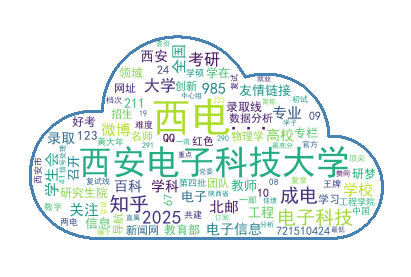

# spider_wordcloud 项目说明文档

## 一、项目思路

本项目旨在实现对指定关键词在百度搜索结果中的爬取，并生成**中文词云**图。主要思路如下：

1. **关键词输入**：用户输入需要分析的关键词。
2. **百度搜索抓取**：通过百度搜索结果页面，抓取对应关键词的标题和摘要。
3. **文本整理**：合并多页抓取的内容形成完整文本。
4. **中文分词**：使用 `jieba` 进行中文分词与 TF-IDF 关键词提取。
5. **词云生成**：使用 `WordCloud` 生成词云，可自定义形状（如云朵形状）。
6. **结果保存与展示**：将爬取文本和生成的词云图保存到本地，并用 matplotlib 显示。

---

## 二、项目框架

项目主要包含以下模块：

```
spider_wordcloud/
├─ spider_wordcloud.py    # 主程序文件
├─ txt_data/              # 爬取文本与词云图片保存目录
├─ cloud.png              # 云朵形状词云的mask图片
├─ requirements.txt       # 项目配置文档
└─ README.md              # 项目说明文档
```

代码逻辑框架如下：

```
用户输入关键词 → 循环抓取百度搜索结果 → 解析标题和摘要 → 合并文本
→ 中文分词 → TF-IDF提取关键词 → 生成词云（可自定义形状） → 保存与展示
```

---

## 三、项目功能

1. **爬取百度搜索结果**

   * 支持多页抓取（默认 5 页，可修改）。
   * 支持随机延迟，防止反爬机制阻拦。
   * 获取内容包括标题和摘要。

2. **文本处理**

   * 使用 `jieba` 中文分词。
   * 通过 TF-IDF 提取关键词及其权重。

3. **词云生成**

   * 可设置词云最大词数（topK 参数）。
   * 可自定义词云形状（mask 参数，如云朵形状）。
   * 中文字体显示支持，避免乱码。
   * 自动保存词云图和文本。

---

## 四、代码说明

### 1. `get_html(keyword, page)`

* 功能：获取百度搜索结果 HTML。
* 参数：

  * `keyword`：搜索关键词
  * `page`：抓取页码
* 返回：HTML 字符串

### 2. `parse_html(html)`

* 功能：解析搜索结果标题与摘要
* 返回：`titles`、`summaries` 列表

### 3. `crawl(keyword, max_pages=5)`

* 功能：循环抓取多页搜索结果
* 返回：完整文本字符串

### 4. `generate_wordcloud(text, keyword, topK=100, mask_path='cloud.png')`

* 功能：生成中文词云图
* 核心逻辑：

  ```python
  keywords = jieba.analyse.extract_tags(text, topK=topK, withWeight=True)
  freq_dict = {word: weight for word, weight in keywords}
  mask = np.array(Image.open(mask_path))
  WordCloud(font_path="C:/Windows/Fonts/simhei.ttf", mask=mask).generate_from_frequencies(freq_dict)
  ```

---

## 五、运行过程
1. **安装项目依赖**
    ```bash
    pip install -r requirements.txt
    ```

2. **运行程序**

   ```bash
   python spider_wordcloud.py
   ```

3. **输入关键词**

   ```
   请输入关键词：西电
   ```

4. **程序输出**

   * 爬取百度搜索结果进度
   * 保存爬取文本：`txt_data/西电_result.txt`
   * 生成词云图片：`txt_data/词云图_西电.png`

5. **显示词云**
   程序完成后会自动弹出 matplotlib 图形窗口展示词云。

---

## 六、运行结果截图示例

1. **爬取文本文件**

   ```
   txt_data/西电_result.txt
   ├─ 西安电子科技大学 电子工程学院2025-09-17西电学子在电磁场与无线技术专业虚拟教研室电磁大赛中喜获佳绩...
   ├─ 研究生 【名师西电】学校举行第十届华山青年学者国际论坛 【幸福西电】学校完成周转公寓分配工作 阅读更多...
   └─ ...
   ```

2. **云朵形状词云图**

  

---

## 七、注意事项

1. **中文字体**：确保系统中有 `simhei.ttf` 或 `msyh.ttc`，避免词云中文字乱码。
2. **云朵形状**：需要提前准备 `cloud.png` 黑白图片，黑色部分为词云填充区域。
3. **访问间隔**：随机延迟 1~2 秒，防止百度反爬。
4. **可调整参数**：

   * `max_pages`：抓取页数
   * `topK`：词云关键词数量


